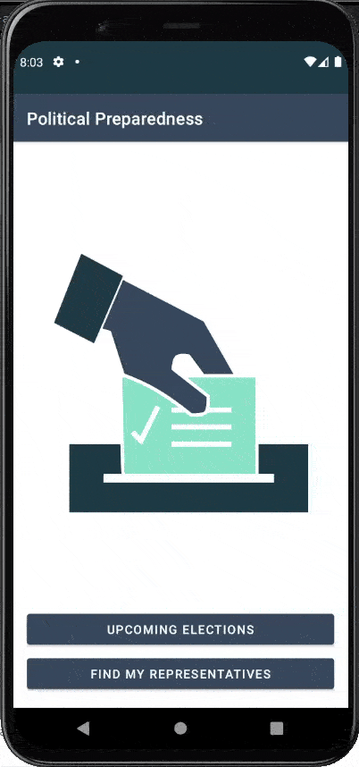

# Political Preparedness

**Political Preparadness** is an Android app that provides civic data intended to provide educational opportunities to the U.S. electorate using data provided by the Google Civic Information API.

I developed this application as part of the Udacity's [Android Kotlin Developer Nanodegree](https://www.udacity.com/course/android-kotlin-developer-nanodegree--nd940) Program.

This app demonstrates the following views and techniques:

## Key dependencies and concepts
* [Retrofit](https://square.github.io/retrofit/) to make api calls to an HTTP web service.
* [Moshi](https://github.com/square/moshi) which handles the deserialization of the returned JSON to Kotlin data objects. 
* [Glide](https://bumptech.github.io/glide/) to load and cache images by URL.
* Repository pattern - to hide the complexity of managing the interactions between the database and the networking code.
  
It leverages the following components from the **Jetpack** library:

* [ViewModel](https://developer.android.com/topic/libraries/architecture/viewmodel)
* [LiveData](https://developer.android.com/topic/libraries/architecture/livedata)
* [Data Binding](https://developer.android.com/topic/libraries/data-binding/) with binding adapters
* [Navigation](https://developer.android.com/topic/libraries/architecture/navigation/) with the SafeArgs plugin for parameter passing between fragments
* [RecyclerView](https://developer.android.com/guide/topics/ui/layout/recyclerview)
* [Room](https://developer.android.com/training/data-storage/room) for local database storage.


## Setting up the Repository

To get started with this project, simply pull the repository and import the project into Android Studio. From there, deploy the project to an emulator or device. 

* NOTE: In order for this project to pull data, you will need to add your API Key to the project as a value in the CivicsHttpClient. You can generate an API Key from the [Google Developers Console](https://console.developers.google.com/)
* Get the API Key and add it to the local.properties like this:
```properties
API_KEY=YOUR_API_KEY
```

## Application flow
Take a look at some of the things you can do with this app:





